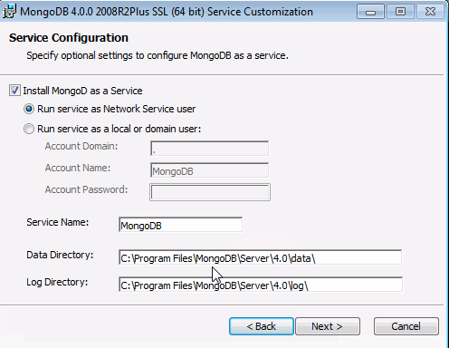
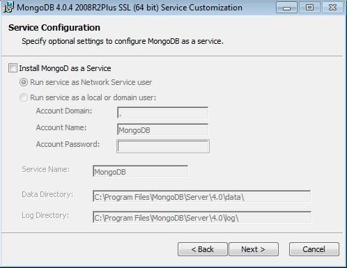

# Deploy mongoDB

Select the operating system on which you are installing MongoDB:

+ [Linux](#linux)
+ [macOS](#macos)
+ [Windows](#windows)

## Linux

This instruction is for Ubuntu only if your are other than Ubuntu, please follow the instruction from [official website](https://docs.mongodb.com/manual/administration/install-on-linux/){target=_blank}

### Install MongoDB Community Edition

Follow these steps to install MongoDB Community Edition using the apt package manager.

#### 1. **Import the public key used by the package management system.**

From a terminal, issue the following command to import the MongoDB public GPG Key from <https://www.mongodb.org/static/pgp/server-4.2.asc>{target=_blank}:

```bash
wget -qO - https://www.mongodb.org/static/pgp/server-4.2.asc | sudo apt-key add -
```

The operation should respond with an OK.

However, if you receive an error indicating that gnupg is not installed, you can:

1. Install gnupg and its required libraries using the following command:

    ```bash
    sudo apt-get install gnupg
    ```

2. Once installed, retry importing the key:

    ```bash
    wget -qO - https://www.mongodb.org/static/pgp/server-4.2.asc | sudo apt-key add -
    ```

#### 2. **Create a list file for MongoDB.**

Create the list file /etc/apt/sources.list.d/mongodb-org-4.2.list for your version of Ubuntu.

Choose the appropriate option for your version of Ubuntu. If you are unsure of what Ubuntu version the host is running, open a terminal or shell on the host and execute lsb_release -dc.

+ Ubuntu 18.04 (Bionic)  
  Create the /etc/apt/sources.list.d/mongodb-org-4.2.list file for Ubuntu 18.04 (Bionic):

  ```bash
  echo "deb [ arch=amd64,arm64 ] https://repo.mongodb.org/apt/ubuntu bionic/mongodb-org/4.2 multiverse" | sudo tee /etc/apt/sources.list.d/mongodb-org-4.2.list
  ```

+ Create the /etc/apt/sources.list.d/mongodb-org-4.2.list file for Ubuntu 16.04 (Xenial):  

  ```bash
  echo "deb [ arch=amd64,arm64 ] https://repo.mongodb.org/apt/ubuntu xenial/mongodb-org/4.2 multiverse" | sudo tee /etc/apt/sources.list.d/mongodb-org-4.2.list
  ```

#### 3. **Reload local package database.**

Issue the following command to reload the local package database:

```bash
sudo apt-get update
```

#### 3. **Install the MongoDB packages.**

To install the latest stable version, issue the following:

```bash
sudo apt-get install -y mongodb-org
```

Optional. Although you can specify any available version of MongoDB, apt-get will upgrade the packages when a newer version becomes available. To prevent unintended upgrades, you can pin the package at the currently installed version:

```bash
echo "mongodb-org hold" | sudo dpkg --set-selections
echo "mongodb-org-server hold" | sudo dpkg --set-selections
echo "mongodb-org-shell hold" | sudo dpkg --set-selections
echo "mongodb-org-mongos hold" | sudo dpkg --set-selections
echo "mongodb-org-tools hold" | sudo dpkg --set-selections
```

### **Run MongoDB Community Edition**

#### 1. Start MongoDB.

You can start the mongod process by issuing the following command:

```bash
sudo systemctl start mongod
```

If you receive an error similar to the following when starting mongod:

>Failed to start mongod.service: Unit mongod.service not found.

Run the following command first:

```bash
sudo systemctl daemon-reload
```

Then run the start command above again.

#### 2. **Verify that MongoDB has started successfully.**

```bash
sudo systemctl status mongod
```

You can optionally ensure that MongoDB will start following a system reboot by issuing the following command:

```bash
sudo systemctl enable mongod
```

#### 3. **Stop MongoDB**

As needed, you can stop the mongod process by issuing the following command:

```bash
sudo systemctl stop mongod
```

### 4. **Restart MongoDB.**

You can restart the mongod process by issuing the following command:

```bash
sudo systemctl restart mongod
```

You can follow the state of the process for errors or important messages by watching the output in the /var/log/mongodb/mongod.log file.

*ref: <https://docs.mongodb.com/manual/tutorial/install-mongodb-on-ubuntu/#create-a-list-file-for-mongodb>{target=_blank}*

## macOS

### Install MongoDB Community Edition

#### Prerequisites

If you have the Homebrew brew package installed on your OSX host and you have previously tapped the official [MongoDB Homebrew Tap](https://github.com/mongodb/homebrew-brew){target=_blank}, skip the prerequisites and go to the [Procedure](#procedure) step.

#### Install XCode

Apple’s XCode includes command-line tools that are required by brew, and is available for free on the App Store. Make sure you are running the latest version.

#### Install Homebrew

OSX does not include the Homebrew brew package by default. Install brew using the [official instructions](https://brew.sh/#install){target=_blank}.

#### Tap the MongoDB Homebrew Tap

Issue the following from the terminal to tap the official [MongoDB Homebrew Tap](https://github.com/mongodb/homebrew-brew){target=_blank}:

```bash
brew tap mongodb/brew
```

#### Procedure

Follow these steps to install MongoDB Community Edition using the third-party brew package manager.

From a terminal, issue the following:

```bash
brew install mongodb-community@4.2
```

### Run MongoDB Community Edition

Follow these steps to run MongoDB Community Edition. These instructions assume that you are using the default settings.

You can run MongoDB as a macOS service using brew, or you can run MongoDB manually as a background process. It is recommended to run MongoDB as a macOS service, as doing so sets the correct system ulimit values automatically (see [ulimit settings](https://docs.mongodb.com/manual/reference/ulimit/#ulimit-settings){target=_blank} for more information).

+ To run MongoDB (i.e. the mongod process) as a macOS service, issue the following:

  ```bash
  brew services start mongodb-community@4.2
  ```

+ To run MongoDB manually as a background process, issue the following:

  ```bash
  mongod --config /usr/local/etc/mongod.conf --fork
  ```

Both methods use the /usr/local/etc/mongod.conf file created during the install. You can add your own [MongoDB configuration](https://docs.mongodb.com/manual/reference/configuration-options/){target=_blank} options to this file as well.

To verify that MongoDB is running, search for mongod in your running processes:

```bash
ps aux | grep -v grep | grep mongod
```

You can also view the log file to see the current status of your mongod process: /usr/local/var/log/mongodb/mongo.log.

### Connect and Use MongoDB

To begin using MongoDB, connect a mongo shell to the running instance. From a new terminal, issue the following:

```bash
mongo
```

*ref: <https://docs.mongodb.com/manual/tutorial/install-mongodb-on-os-x/>{target=_blank}*

## Windows

### Install MongoDB Community Edition

#### Prerequisites

Users on Windows versions previous to Windows 10 must install the following update before installing MongoDB:

> [Update for Universal C Runtime for Windows](https://support.microsoft.com/en-us/help/2999226/update-for-universal-c-runtime-in-windows){target=_blank}

Users on Windows 10, Server 2016 and Server 2019 do not need this update.

#### Procedure

Follow these steps to install MongoDB Community Edition using the MongoDB Installer wizard. The installation process installs both the MongoDB binaries as well as the default [configuration file](https://docs.mongodb.com/manual/reference/configuration-options/){target=_blank} \<install directory>\bin\mongod.cfg.

1. **Download MongoDB Community Edition.**

    Download the installer (.msi) from the [MongoDB Download Center](https://www.mongodb.com/download-center/community?jmp=docs){target=_blank}:  

    + The Download Center should display **MongoDB Community Server** download information. If not, select **Server**, then click the **MongoDB Community Server** tab.  

    + In the **Version** dropdown, select the version that corresponds to the latest MongoDB Server 4.2.

    + In the **OS** dropdown, **Windows 64-bit X64** should be selected.  

    + In the **Package** drop down, **MSI** should be selected.  

    + Click **Download**.

2. **Run the MongoDB installer.**

    For example, from the Windows Explorer/File Explorer:

    + Go to the directory where you downloaded the MongoDB installer (**.msi** file). By default, this is your **Downloads** directory.  

    + Double-click the **.msi** file.

3. **Follow the MongoDB Community Edition installation wizard.**

    The wizard steps you through the installation of MongoDB and MongoDB Compass.


##### a. Choose Setup Type

You can choose either the **Complete** (recommended for most users) or **Custom** setup type. The **Complete** setup option installs MongoDB and the MongoDB tools to the default location. The **Custom** setup option allows you to specify which executables are installed and where.

##### b. Service Configuration

Starting in MongoDB 4.0, you can set up MongoDB as a Windows service during the install or just install the binaries.

+ [MongoDB Service](#mongodb-service)
+ [MongoDB](#mongodb)

###### MongoDB Service

The following installs and configures MongoDB as a Windows service.

Starting in MongoDB 4.0, you can configure and start MongoDB as a Windows service during the install, and the MongoDB service is started upon successful installation.



+ Select **Install MongoD as a Service** MongoDB as a service.

+ Select either:
  
  + **Run the service as Network Service user** (Default)  
  
    This is a Windows user account that is built-in to Windows  

    **or**

  + **Run the service as a local or domain user**

    + For an existing local user account, specify a period (i.e. .) for the **Account Domain** and specify the **Account Name** and the **Account Password** for the user.  

    + For an existing domain user, specify the **Account Domain**, the **Account Name** and the **Account Password** for that user.

+ **Service Name**. Specify the service name. Default name is **MongoDB**. If you already have a service with the specified name, you must choose another name.

+ **Data Directory**. Specify the data directory, which corresponds to the `--dbpath`. If the directory does not exist, the installer will create the directory and sets the directory access to the service user.

+ **Log Directory**. Specify the Log directory, which corresponds to the `--logpath.` If the directory does not exist, the installer will create the directory and sets the directory access to the service user.

###### MongoDB

The following installs MongoDB only and does not configure MongoDB as a Windows service.

If you choose not to configure MongoDB as a Windows service, uncheck the **Install MongoD as a Service**.



##### c. Install MongoDB Compass

For Windows 8 or greater, you can have the wizard install [MongoDB Compass](https://www.mongodb.com/products/compass){target=_blank}. To install Compass, select Install **MongoDB Compass** (Default).

##### d. When ready, click **Install.**

#### If You Installed MongoDB as a Windows Service

The MongoDB service is started upon successful installation

To begin using MongoDB, connect a `mongo.exe` shell to the running MongoDB instance. Either:

+ From Windows Explorer/File Explorer, go to **C:\Program Files\MongoDB\Server\4.2\bin\\** directory and double-click on mongo.exe.

+ Or, open a Command Interpreter with Administrative privileges and run:
  
  ```bash
  C:\Program Files\MongoDB\Server\4.2\bin\mongo.exe
  ```

#### If You Did Not Install MongoDB as a Windows Service

If you only installed the executables and did not install MongoDB as a Windows service, you must manually start the MongoDB instance.

See Run [MongoDB Community Edition from the Command Interpreter](https://docs.mongodb.com/manual/tutorial/install-mongodb-on-windows/#run-mongodb-from-cmd){target=_blank} for instructions to start a MongoDB instance.

### Run MongoDB Community Edition as a Windows Service

Starting in version 4.0, you can install and configure MongoDB as a **Windows Service** during the install, and the MongoDB service is started upon successful installation. MongoDB is configured using the configuration file **\<install directory>\bin\mongod.cfg**.

#### Start MongoDB Community Edition as a Windows Service

To start/restart the MongoDB service, use the Services console:

1. From the Services console, locate the MongoDB service.
2. Right-click on the MongoDB service and click **Start**.

To begin using MongoDB, connect a `mongo.exe` shell to the running MongoDB instance. To connect, open a **Command Interpreter** with Administrative privileges and run:

```bash
C:\Program Files\MongoDB\Server\4.2\bin\mongo.exe
```

#### Stop MongoDB Community Edition as a Windows Service

To stop/pause the MongoDB service, use the Services console:

1. From the Services console, locate the MongoDB service.
2. Right-click on the MongoDB service and click **Stop** (or **Pause**).

#### Remove MongoDB Community Edition as a Windows Service

To remove the MongoDB service, first use the Services console to stop the service. Then open a [Windows command prompt/interpreter](https://docs.microsoft.com/en-us/windows-server/administration/windows-commands/cmd){target=_blank} (**cmd.exe**) as an **Administrator**, and run the following command:

```bash
sc.exe delete MongoDB
```

### Run MongoDB Community Edition from the Command Interpreter

You can run MongoDB Community Edition from the [Windows command prompt/interpreter](https://docs.microsoft.com/en-us/windows-server/administration/windows-commands/cmd){target=_blank} (**cmd.exe**) instead of as a service.

Open a [Windows command prompt/interpreter](https://docs.microsoft.com/en-us/windows-server/administration/windows-commands/cmd) (**cmd.exe**){target=_blank} as an **Administrator**.

### 1. Create database directory.

Create the `data directory` where MongoDB stores data. MongoDB’s default data directory path is the absolute path **\data\db** on the drive from which you start MongoDB.

From the **Command Interpreter**, create the data directories:

```bash
cd C:\
md "\data\db"
```

### 2. Start your MongoDB database.

To start MongoDB, run `mongod.exe`.

```bash
"C:\Program Files\MongoDB\Server\4.2\bin\mongod.exe" --dbpath="c:\data\db"
```

The `--dbpath` option points to your database directory.

If the MongoDB database server is running correctly, the **Command Interpreter** displays:

>[initandlisten] waiting for connections

### 3. Connect to MongoDB.

To connect a `mongo.exe` shell to the MongoDB instance, open another **Command Interpreter** with Administrative privileges and run:

```bash
"C:\Program Files\MongoDB\Server\4.2\bin\mongo.exe"
```

*ref: <https://docs.mongodb.com/manual/tutorial/install-mongodb-on-windows/>{target=_blank}*