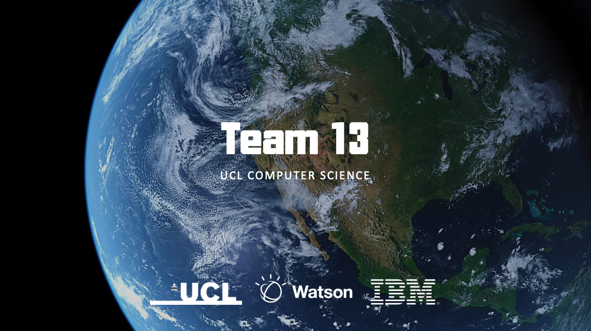

## Bi-Weekly Reports
To report and mark our progress, and plan our prorities, we have been documenting our progress every two week at the following dates:

Term 1 (2019): Nov 22, Dec 6

Term 2 (2020): Jan 24, Feb 7, Feb 28, Mar 13, Mar 27

Links to the reports respectively:

- [Bi-Weekly Report 1](downloads/bi_weekly_report_1.pdf){target=_blank}
- [Bi-Weekly Report 2](downloads/bi_weekly_report_2.pdf){target=_blank}
- [Bi-Weekly Report 3](downloads/bi_weekly_report_3.pdf){target=_blank}
- [Bi-Weekly Report 4](downloads/bi_weekly_report_4.pdf){target=_blank}
- [Bi-Weekly Report 5](downloads/bi_weekly_report_5.pdf){target=_blank}
- [Bi-Weekly Report 6](downloads/bi_weekly_report_6.pdf){target=_blank}
- [Bi-Weekly Report 7](downloads/bi_weekly_report_7.pdf){target=_blank}

## Business Card and Image target Demo

To demonstrate the use of AR and QR code scanning, you can download the following image target. You could print them out as business cards, or display them on another device (such as iPad or another phone). The file contain the QR code and business card dummy for the 3 demo users.

[Download the demo for printing (pdf)](downloads/image_target.pdf){target=_blank}

## Download or View the Application

**Flutter Mobile App** -  [Download for Android (*.apk)](https://github.com/IBM-AR-CARD/Flutter-AR-Mobile-App/releases/download/v1.0/app.apk){target=_blank} - [More Releases](https://github.com/IBM-AR-CARD/Flutter-AR-Mobile-App/releases){target=_blank} - [Alternative onedrive link](https://bit.ly/AR-Card){target=_blank}

**Vue Web Dashboard** - [http://ar-card.henryz.cc/app](http://ar-card.henryz.cc/app){target=_blank}