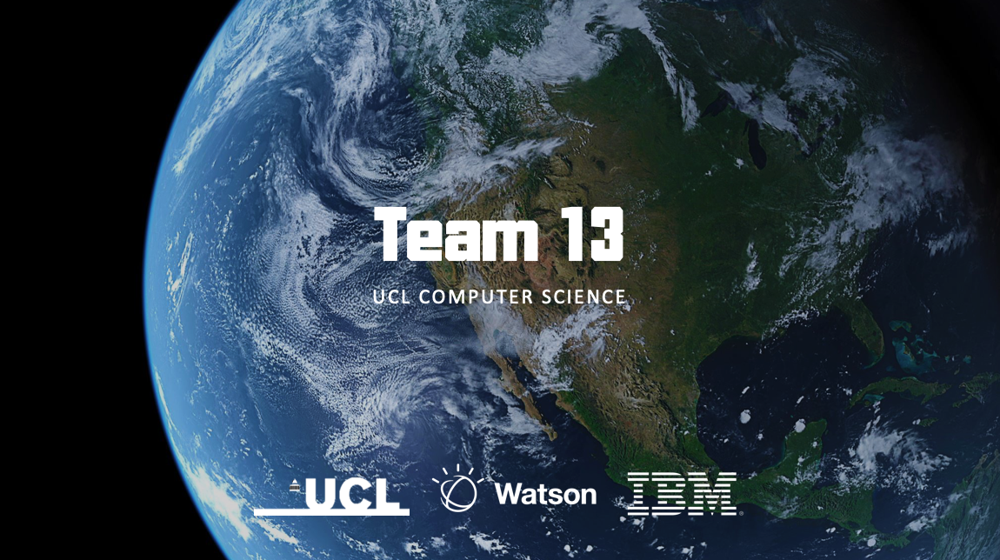

# IBM AR Business Card

## Welcome

Welcome to IBM AR Business Card's Appendices and Documentation. Here are a list of shortcuts:

- [User Manual](Flutter-Manual/)
- [Deployment Manual](Deploy-Flutter/)
- [API Documentation](Welcome-API/)
- [Bi-Weekly Reports and Demo Card Downloads](Reports-And-Downloads/)

---
[View this documentation in a new tab](https://ibm-ar-card.github.io/API-Documentation/){target=_blank}

## Download or View the Application

**Flutter Mobile App** -  [Download for Android (*.apk)](https://github.com/IBM-AR-CARD/Flutter-AR-Mobile-App/releases/download/v1.0/app.apk){target=_blank} - [More Releases](https://github.com/IBM-AR-CARD/Flutter-AR-Mobile-App/releases){target=_blank} - [Alternative onedrive link](https://bit.ly/AR-Card){target=_blank}

**Vue Web Dashboard** - [http://ar-card.henryz.cc/app](http://ar-card.henryz.cc/app){target=_blank}

You can use the demo accounts listed below (use email and password to login): 

| Username      | Email            | Password   |
| ------------- | ---------------- | ---------- |
| `jonmcnamara` | `john@ucl.ac.uk` | `password` |
| `amy-pajak`   | `amy@ucl.ac.uk`  | `password` |
| `ben-jones`   | `ben@ucl.ac.uk`  | `password` |

## Useful Links

**Backend Server Address** -  [http://ar-card.henryz.cc:8080](http://ar-card.henryz.cc:8080){target=_blank}

**MongoDB Management** - [Mongo Express (8888)](http://ar-card.henryz.cc:8888/){target=_blank}

**Github Repositories** - [https://github.com/IBM-AR-CARD](https://github.com/IBM-AR-CARD){target=_blank}

## Business Card and Image target Demo

To demonstrate the use of AR and QR code scanning, you can download the following image target. You could print them out as business cards, or display them on another device (such as iPad or another phone). The file contain the QR code and business card dummy for the 3 demo users.

[Download the demo for printing (pdf)](downloads/image_target.pdf){target=_blank}